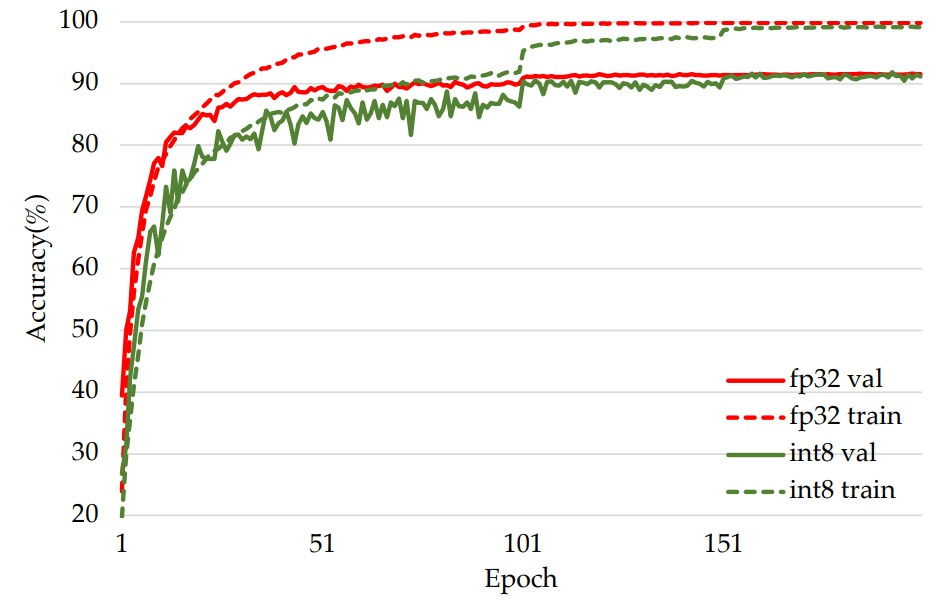

# Neural networks Training and Inference using Integer-only arithmetic
# Modified Version
## Installation
  - create conda envrionment and install packages via pip (pip install bokeh tensorboard pandas jupyterlab scikit-learn numpy==1.20.3)
  - install cuda toolkit -> if nessesary, link to in .bashrc /etc/local/cuda-11.1/
  - the setup.py files in niti/pytorch/cutlass-extension etc have been updates to absolute path (different to local path due to docker container)
  - Download cuDNN v8.0.5 (November 9th, 2020), for CUDA 11.1 [cuDNN Library for Linux (x86_64)]
  This version is exactly used in Docker-container image pytorch/pytorch:1.8.0-cuda11.1-cudnn8-devel for cuDNN and other version throw NaN error or core dumped. [link](https://developer.nvidia.com/compute/machine-learning/cudnn/secure/8.0.5/11.1_20201106/cudnn-11.1-linux-x64-v8.0.5.39.tgz)
  -After cuDNN download do following steps:
    1. extract content e.g. via tar -xzvf cudnn-11.0-linux-....
    2. sudo cp cuda/include/cudnn*.h /usr/local/cuda-11.1/include
    3. sudo cp cuda/lib64/libcudnn* /usr/local/cuda-11.1/lib64
    4. sudo chmod a+r /usr/local/cuda/include/cudnn*.h /usr/local/cuda-11.1/lib64/libcudnn*
    - Now cuDNN is linked into nvcc location and headers such as <cudnn.h> can be found
  - conda install pytorch==1.8.0 torchvision==0.9.0 torchaudio==0.8.0 cudatoolkit=11.1 -c pytorch -c conda-forge
  - run make in main niti folder. and you should be able to execute the project without any docker container.

## Update(Nov 2021)
I've made some improvments recently:
- Pure int8 training has no accuracy degradation on CIFAR10 comparing with fp32 now.
- Implementation of faster native int8 convolution forward pass and backward pass based on NVIDIA's cutlass
- Update CUDA versoin to 11.1 to support RTX 3090(sm86). Please update driver and change the dockerfile pytorch version if you want to use it.
- The arxiv paper will be updated to discuss the improvements soon.

## Introduction
NITI is a training framework which uses 8 bits signed integer exclusively to train neural network.
It's currently implemented on Nvidia GPU with tensor cores(like V100, RTX 2080Ti, T4, RTX 8000, and RTX 3090).
The major computation flow of the convolution and fully connected layer are shown below:

## Usage
### Step 1: Update NVIDIA driver and install NVIDIA docker
https://docs.nvidia.com/datacenter/cloud-native/container-toolkit/install-guide.html
and configure the toolkit with same instructions of the site above. This toolkit is specially for containerized GPU accelerations
### Step 2: Download NITI
> git clone https://github.com/wangmaolin/niti.git
put it not in /home folder because docker has no permissions to it. Rather use /media
### Step 3: Modify the path in docker_run.sh
Change NITI_PATH in docker_run.sh to the location where you download NITI.
and perhaps also change the pytorch version in docker_file since we use different architecture
### Step 4: Launch the docker at $NITI_PATH
> docker_run.sh

### Step 5: Install the tensor core extension
Inside the docker, run:
> make

## Examples of training int8 VGG on CIFAR10
> ./train_vgg_cifar10.sh

## Visualize training results
Example results of training VGG-small-7, VGG-small-8 and VGG-small-9 with integer arithmetic are located at ./results. Comparing with floating point, there is no accuracy degradation for these 3 networks.

For example, this is the training curves for VGG-small-9:

If you want to to check detailed training information, run:

> tensorboard --logdir results/int-vgg-small-8/runs

## Notes
Current implementation utilizes cuBLAS and CUTLASS to run int8 matrix multiply and convolution operations directly on tensor cores.
###### cuBLAS is essentially non open source, code is unavailable and no documentation (internal processes) and is therefore hard to understand and not really possible to modify. Whereas CUTLASS is a well-documented version while cuBLAS is based on some CUTLASS code, it is highly recommended to start learning CUTLASS since is a solid basis for understanding the algorithms etc.

## Some key codes
### ti_torch.py
Implementation of convolution, fully connected layer with int8 forward pass and backward pass

### pytorch/cutlass-extension
CUDA extension doing 8 bits integer convolution forward pass and backward pass

### pytorch/tcint8mm-extension
CUDA extension using tensor core to accelerate 8 bit signed integer matrix multiply
